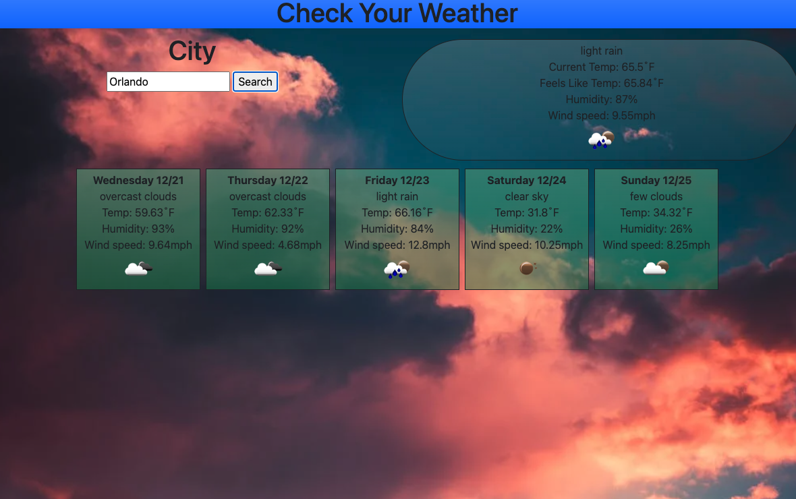

  # City Weather App 

  ## Description:
  This is a local city weather app. That lets you search the current weather and the five day forcast

  
    

  

  ## Table of Contents:
  - [Installation](#installation)
  - [Usage](#usage)
  - [License](#license)
  - [Contributions](#contributions)
  - [Published Page](#page)
  - [Repo](#repo)

 ## Installation
  No install needed just go to the webpage and enter your city in the search bar

 ## Usage 
  Enter your city in the search bar. YOu will be given the current weather and the five day forecast. You can also enter multiple cities and switch between the ones you  have previously searched

 ## License 
  
  
 
  

 ## Contributions 
  N/A

 ## Screen Shot

# LINKS

 ## Page 
  https://zcordeiro.github.io/City-Weather-Forecast/

 ## Repo 
   https://github.com/Zcordeiro/city-weather-app
