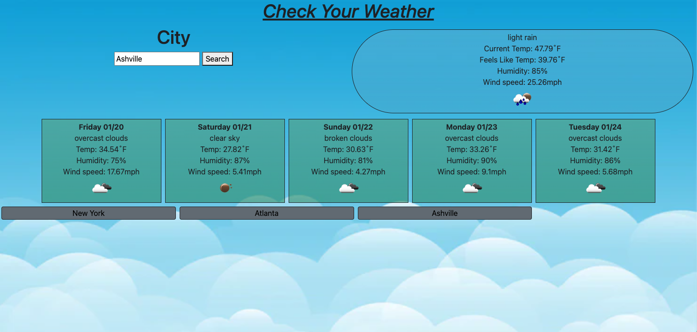

# city-weather-app
This is a local city weather app.

## Information
The following webpage lets you search the city you live in and it will give you the current weather as well as the next 5 day forecast.

It was made using the openweathermap API to collect the weather information.

## Screenshot of finished page 

## Link to github pages and repo

Published Page - https://zcordeiro.github.io/city-weather-app/

REPO - https://github.com/Zcordeiro/city-weather-app